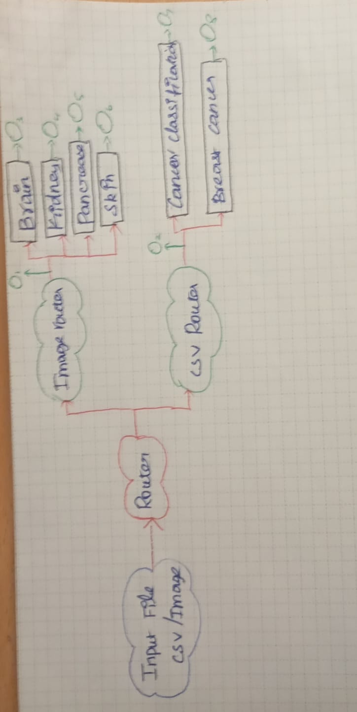

# PROJECT_OVERVIEW.md

## Project: Multimodel with cascade of experts

### Cascade of Experts

This project leverages a **cascade of experts** approach for multimodal classification. In this architecture, multiple specialized models (experts) are trained to handle different aspects or modalities of the data, such as images and tabular features. 

The cascade works by sequentially passing data through these experts:
- Each expert makes a prediction or extracts features relevant to its domain.
- The outputs are combined or routed to subsequent experts, allowing the system to make more informed decisions.
- This hierarchical structure improves overall accuracy by utilizing the strengths of each expert and reducing the impact of noisy or irrelevant data.

The cascade of experts is particularly effective for complex tasks where different data types require specialized processing.

## Datasets Used
[Cancer Classification CSV](https://www.kaggle.com/datasets/erdemtaha/cancer-data)

[Breast Cancer Classification CSV](https://www.kaggle.com/datasets/wasiqaliyasir/breast-cancer-dataset)

[Image Classification](https://www.kaggle.com/datasets/ramachandraudupa/multicancer-dataset)

## 🧠 Cascade of Experts Architecture


## Directory Structure


- `.gitattributes`, `.gitignore`  
  Git settings and ignored files.

- `main.py`  
  Main Router which gets input file like Image and CSV file

- `README.md`  
  Basic project description.

- `requirements.txt`  
  Python dependencies.

- `task_description.png`  
  Visual description of the project task.

- `data/`  
  Contains datasets in various formats:
  - `breast-cancer-wisconsin.data.txt`
  - `cancer_classification.csv`
  - `cancer_data.tsv`
  - `cervical_cancer.csv`
  - `README.md`
  - Subfolders for specific datasets and test data.
  
  - `test_folder/`
    - The images and csv file which needed to be tested are located here  

- `notebooks/`  
  Jupyter notebooks for exploration and modeling:
  - `brain_speacilist.ipynb`
  - `breast_cancer.ipynb`
  - `csv_cancer_classification.ipynb`
  - `router_model.ipynb`
  - `speacilist_model.ipynb`
  - `ignore/` (notebooks to be ignored)


## Source Code Structure (`src/`)

The `src/` folder contains the main source code for the multimodal classification project. Its typical structure is as follows:

- `src/`
  - `__init__.py`  
    Marks the folder as a Python package
  - `Experts/`
    - `brain`
    - `kidney`
    - `pancrease`
    - `skin`  
  - `router/`  
    Data loading and preprocessing scripts for both image and tabular data.
    - `image_router`  
      Sub Router model which will be re routed to the Brain, Kidney, Pancerease, Skin. If the given input image is not found it will be output as Unspecified
    - `csv_router`  
      CSV Router which will route it to the cancer classification and breast classification route.
  - `models/`  
        The trained model are stored in this folder
  - `utils/`  
    Utility functions and helpers.
  - `config.py`  
    Centralized configuration for paths, hyperparameters, etc.
  - `main.py`  
    Entry point for running experiments or training.

---

### How It Works

- **Data Loading:**  
  The `data/` subfolder provides modular scripts for loading and preprocessing both images and CSV files, ensuring clean and consistent input for models.

- **Model Definitions:**  
  The `models/` subfolder contains separate files for image, tabular, and multimodal models, allowing easy experimentation and extension.

- **Training & Evaluation:**  
  The `training/` subfolder includes scripts for training models and evaluating their performance, supporting reproducible experiments.

- **Utilities:**  
  The `utils/` subfolder offers reusable functions for metrics, visualization, and logging, streamlining the workflow.

- **Configuration:**  
  The `config.py` file centralizes settings, making it easy to adjust hyperparameters and paths.

- **Main Script:**  
  The `main.py` script orchestrates the overall pipeline, from data loading to model training and evaluation.

---

This modular structure makes the codebase easy to maintain, extend, and experiment with different multimodal approaches.

- `utils/`  
  Utility scripts and helper functions.

---

### Option 1: Using pip

1. Install dependencies:
    ```sh
    pip install -r requirements.txt
    ```
2. Run the main script:
    ```sh
    python main.py
    ```

### Option 2: Using Conda

1. Create and activate a new Conda environment:
    ```sh
    conda create -n multimodel python=3.10
    conda activate multimodel
    ```
2. Install dependencies:
    ```sh
    pip install -r requirements.txt
    ```
3. Run the main script:
    ```sh
    python main.py
    ```

4. Explore data and models in the `notebooks/` directory.
---


